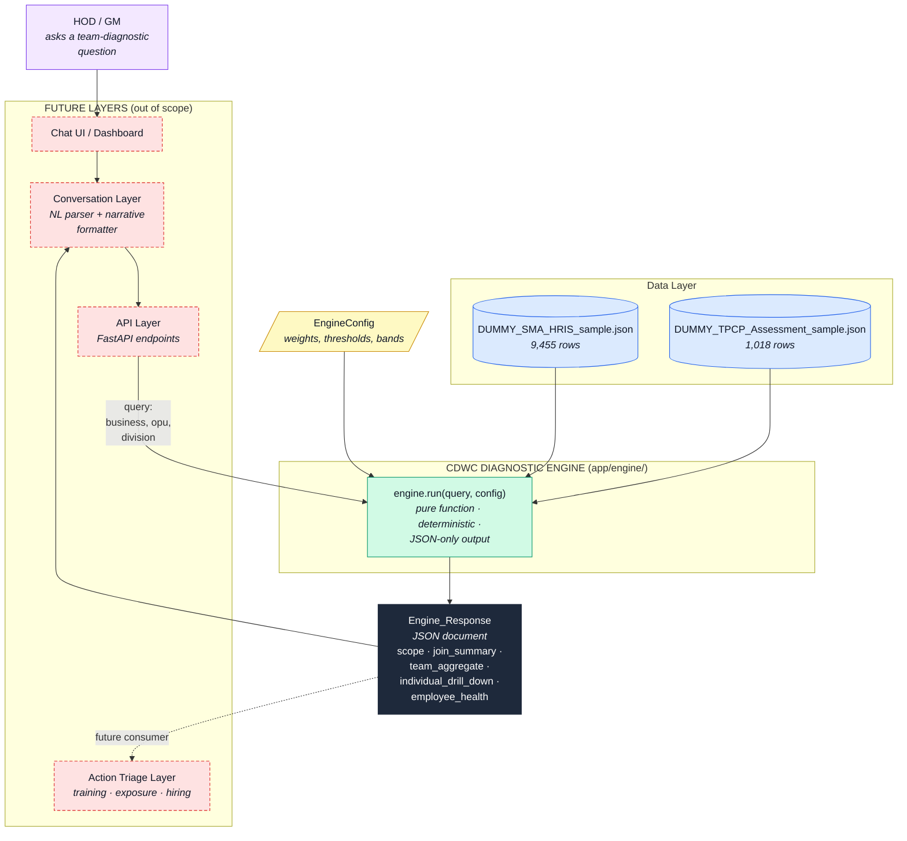
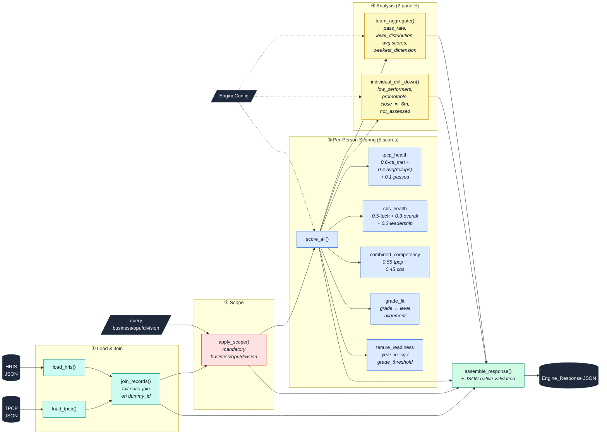
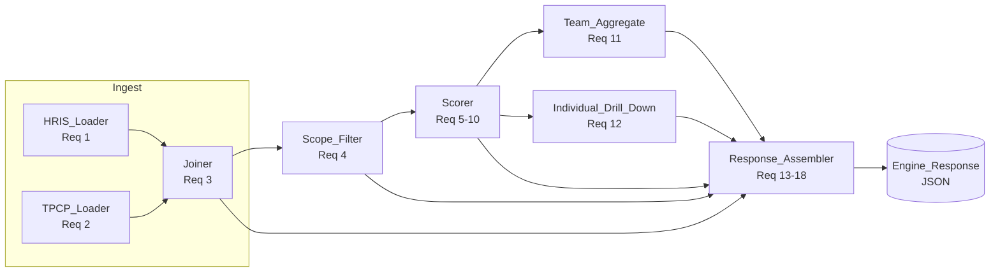

# Design Document

## Overview

The CDWC Diagnostic Engine is a greenfield Python module on the
`cdwc_sma_tpcp` branch that answers team-diagnostic HOD/GM questions by
ingesting two sample files (`data/DUMMY_SMA_HRIS_sample.json` and
`data/DUMMY_TPCP_Assessment_sample.json`), joining them on `dummy_id`,
applying a mandatory org-scope filter (`business`, `opu`, `division`),
computing five 0–1 health scores per employee (TPCP_Health, CBS_Health,
Combined_Competency, Grade_Fit, Tenure_Readiness), and running two
parallel analyses (Team_Aggregate and Individual_Drill_Down). The engine
emits a single structured `Engine_Response` JSON document and stops at
diagnosis. **Out of scope:** action recommendations (training, exposure,
hiring), per-cell competency cell analysis (`b*`, `k*`, `p*`, `e*`
fields), gap matrices, conversation/narrative layers, API wiring, and
UI. The engine consumes only block-level TPCP rollups (`base_pct`,
`key_pct`, `pacing_pct`, `emerging_pct`, `cti_met_pct`) plus identity,
org, and qualification fields.

## High-Level Architecture Diagram

This is the engine viewed from the outside. It shows the engine as a
single logical component, its two data-source inputs, its configuration
input, its single output, the callers it supports, and the explicit
scope boundaries (what is **not** part of the engine). Internal pipeline
detail lives in the **Architecture** section below.

### Context view — the engine and the world around it



**How to read this diagram.** Solid green is in scope; dashed red is
out of scope but shown so the engine's boundaries are unambiguous. The
engine is invoked as a single pure function that takes a scope query
and a config, reads two data files, and returns one JSON document. It
has no side effects beyond that.

### Container view — inside the engine



**What this adds over the module-flow diagram below.** The container
view makes the five scoring formulas visible alongside the pipeline,
shows config as a dotted-line tuning input that every stage reads but
none writes, and makes the "two parallel analyses" concrete. The
module-flow diagram in the next section is the same pipeline annotated
with requirement numbers for traceability.

### Explicit boundaries

| In scope (this engine) | Out of scope (other layers or deferred) |
|---|---|
| HRIS + TPCP ingestion | Free-text chat parsing, intent extraction |
| Full outer join on `dummy_id` | Any persistence layer (no DB, no cache) |
| Mandatory org-scope filtering | Authentication, authorisation, multi-tenant |
| 5 health scores per employee | `critical_gap_score` (dropped with per-cell fields) |
| Team aggregate rollup | Gap matrix / structural-vs-people classification |
| Individual drill-down (4 lists) | Action recommendations (training / exposure / hiring) |
| Structured JSON response | Natural-language narrative, dashboards, reports |
| Deterministic, config-driven formulas | Learned models, A/B testing, feature stores |

## Architecture

The engine is a pure-Python pipeline with a single entry point
(`engine.run(query, config)`). Data flows one-way through seven stages;
there is no shared mutable state.



Flow in prose: the two loaders read their sample files independently
and return lists of per-source dicts keyed by `dummy_id`. The Joiner
performs a full outer join, emitting one `UnifiedEmployeeRecord` per
unique `dummy_id` plus a `JoinSummary`. The Scope_Filter narrows the
pool to the records whose TPCP org fields match the query; HRIS-only
records bypass scope-bound analyses and are parked in an
`hris_only_unscoped` bucket. The Scorer annotates each scoped record
with five health scores. Team_Aggregate and Individual_Drill_Down run
in parallel (logically — no threading required) over the scored pool.
Finally, Response_Assembler composes the `Engine_Response` from
`scope`, `join_summary`, `team_aggregate`, `individual_drill_down`,
and `employee_health`, and validates it is JSON-native before
returning.

## Module Layout

All engine code lives under `app/engine/`. One file per responsibility;
no cross-module imports except through public function signatures.

```
app/
  engine/
    __init__.py        # re-exports engine.run
    config.py          # EngineConfig dataclass + defaults + validation
    loaders.py         # load_hris, load_tpcp
    join.py            # join_records
    scope.py           # apply_scope
    scoring.py         # score_employee, score_all
    analysis.py        # team_aggregate, individual_drill_down
    response.py        # assemble_response, validate_json_native
    engine.py          # run (orchestrator)
    errors.py          # DataLoadError, ConfigError, SerializationError
    types.py           # TypedDicts / dataclasses for all records
tests/
  engine/
    test_loaders.py
    test_join.py
    test_scope.py
    test_scoring.py
    test_analysis.py
    test_response.py
    test_properties.py
    conftest.py
```

Public function signatures each module exposes:

```python
# config.py
@dataclass(frozen=True, slots=True)
class EngineConfig: ...
def default_config() -> EngineConfig: ...

# loaders.py
def load_hris(path: str) -> tuple[list[HRISRecord], list[LoadError]]: ...
def load_tpcp(path: str) -> tuple[list[TPCPRecord], list[LoadError], list[SupersededRecord]]: ...

# join.py
def join_records(
    hris: list[HRISRecord],
    tpcp: list[TPCPRecord],
) -> tuple[list[UnifiedEmployeeRecord], JoinSummary]: ...

# scope.py
def apply_scope(
    records: list[UnifiedEmployeeRecord],
    query: ScopeQuery,
) -> tuple[list[UnifiedEmployeeRecord], list[UnifiedEmployeeRecord], Scope]:
    """Returns (scoped, hris_only_unscoped, scope_metadata)."""

# scoring.py
def score_employee(record: UnifiedEmployeeRecord, config: EngineConfig) -> EmployeeHealth: ...
def score_all(records: list[UnifiedEmployeeRecord], config: EngineConfig) -> list[EmployeeHealth]: ...

# analysis.py
def team_aggregate(health: list[EmployeeHealth], records: list[UnifiedEmployeeRecord]) -> TeamAggregate: ...
def individual_drill_down(
    health: list[EmployeeHealth],
    records: list[UnifiedEmployeeRecord],
    config: EngineConfig,
) -> IndividualDrillDown: ...

# response.py
def assemble_response(
    scope: Scope,
    join_summary: JoinSummary,
    team_agg: TeamAggregate,
    drill: IndividualDrillDown,
    health: list[EmployeeHealth],
) -> EngineResponse: ...
def validate_json_native(obj: object) -> None: ...  # raises SerializationError

# engine.py
def run(query: ScopeQuery, config: EngineConfig | None = None) -> EngineResponse: ...
```

## Data Models

All records are JSON-serialisable. We use `@dataclass(slots=True)` with
`asdict` for constructable value objects, and `TypedDict` for shapes
that are used as plain dicts inside the response (so `json.dumps` works
without a custom encoder).

```python
# types.py
from dataclasses import dataclass, field
from typing import TypedDict, Literal, Optional

# ---- raw inputs -----------------------------------------------------

class HRISRecord(TypedDict, total=False):
    dummy_id: int
    employee_name: str
    superior_name: str
    skill_group: str
    job_grade: str
    salary_grade: str
    year_in_sg: float
    sma_completion_status: str
    overall_cbs_pct: float
    technical_cbs_pct: float
    leadership_cbs_pct: float

class TPCPRecord(TypedDict, total=False):
    dummy_id: int
    employee_name: str
    business: str
    opu: str
    division: str
    skill_group: str
    discipline: str
    sub_discipline: str
    assessment_level: Literal["Staff", "Principal", "Custodian", "Not TP"]
    assessment_type: str
    qualified_level: Literal["Staff", "Principal", "Custodian", "Not TP"]
    passed_tpcp: Literal["Y", "N"]
    base_pct: float
    key_pct: float
    pacing_pct: float
    emerging_pct: float
    cti_met_pct: float
    assessment_date: str  # ISO YYYY-MM-DD

# ---- unified post-join ---------------------------------------------

@dataclass(slots=True)
class UnifiedEmployeeRecord:
    dummy_id: int
    has_hris: bool
    has_tpcp: bool
    # HRIS-sourced (preferred on conflict)
    employee_name: Optional[str] = None
    superior_name: Optional[str] = None
    skill_group: Optional[str] = None
    job_grade: Optional[str] = None
    salary_grade: Optional[str] = None
    year_in_sg: Optional[float] = None
    sma_completion_status: Optional[str] = None
    overall_cbs_pct: Optional[float] = None
    technical_cbs_pct: Optional[float] = None
    leadership_cbs_pct: Optional[float] = None
    # TPCP-sourced
    business: Optional[str] = None
    opu: Optional[str] = None
    division: Optional[str] = None
    discipline: Optional[str] = None
    sub_discipline: Optional[str] = None
    assessment_level: Optional[str] = None
    assessment_type: Optional[str] = None
    qualified_level: Optional[str] = None
    passed_tpcp: Optional[str] = None
    base_pct: Optional[float] = None
    key_pct: Optional[float] = None
    pacing_pct: Optional[float] = None
    emerging_pct: Optional[float] = None
    cti_met_pct: Optional[float] = None
    assessment_date: Optional[str] = None
    # audit (conflicts)
    tpcp_employee_name: Optional[str] = None
    tpcp_skill_group: Optional[str] = None

# ---- scoring --------------------------------------------------------

class EmployeeHealth(TypedDict, total=False):
    dummy_id: int
    employee_name: Optional[str]
    job_grade: Optional[str]
    assessment_level: Optional[str]
    passed_tpcp: Optional[str]
    tpcp_health: float
    cbs_health: float
    combined_competency: float
    grade_fit: Optional[float]         # null when inputs missing
    tenure_readiness: Optional[float]  # null when inputs missing
    tpcp_health_source: Optional[str]
    cbs_health_source: Optional[str]
    combined_competency_source: Optional[str]
    grade_fit_source: Optional[str]
    tenure_readiness_source: Optional[str]

# ---- analysis outputs ----------------------------------------------

class TeamAggregate(TypedDict):
    team_size: int
    assessed_count: int
    not_assessed_count: int
    pass_rate: Optional[float]
    level_distribution: dict[str, int]
    avg_combined_competency: Optional[float]
    avg_tpcp_health: Optional[float]
    avg_cbs_health: Optional[float]
    weakest_dimension: Optional[Literal["base", "key", "pacing", "emerging"]]

class NotAssessedEntry(TypedDict):
    dummy_id: int
    employee_name: Optional[str]
    job_grade: Optional[str]
    sma_completion_status: Optional[str]

class IndividualDrillDown(TypedDict):
    low_performers: list[EmployeeHealth]
    promotable: list[EmployeeHealth]
    close_in_6m: list[EmployeeHealth]
    not_assessed: list[NotAssessedEntry]

# ---- top-level ------------------------------------------------------

class ScopeQuery(TypedDict, total=False):
    business: str
    opu: str
    division: str

class Scope(TypedDict):
    business: Optional[str]
    opu: Optional[str]
    division: Optional[str]
    team_size: int
    excluded_count: int
    hris_only_unscoped_count: int

class JoinSummary(TypedDict):
    both_sources: int
    hris_only: int
    tpcp_only: int
    hris_load_errors: int
    tpcp_load_errors: int
    tpcp_superseded: int

class EngineResponse(TypedDict, total=False):
    scope: Scope
    join_summary: JoinSummary
    team_aggregate: TeamAggregate
    individual_drill_down: IndividualDrillDown
    employee_health: list[EmployeeHealth]
    summary: Literal["scope_empty"]  # present only when team_size == 0
```

## Components and Interfaces

### `loaders.py` — HRIS_Loader & TPCP_Loader

**Responsibilities:** Read each sample file, skip malformed rows, enforce
`dummy_id` integrity, dedupe TPCP by most-recent `assessment_date`.

**Key functions:**

```python
def load_hris(path: str) -> tuple[list[HRISRecord], list[LoadError]]
def load_tpcp(path: str) -> tuple[list[TPCPRecord], list[LoadError], list[SupersededRecord]]
```

**Behaviour:**
- Opens the file with `open(path, "r", encoding="utf-8")`, parses with
  `json.load`. On `OSError` or `json.JSONDecodeError`, raises
  `DataLoadError(path, cause)` — **Req 1.5, Req 2.5**.
- Drops records where `dummy_id` is missing or not `int` into a
  load-error list — **Req 1.4, Req 2.4**.
- HRIS_Loader preserves only the documented field set — **Req 1.2**.
  Missing CBS fields are retained as absent (not zeroed) — **Req 1.3**.
- TPCP_Loader preserves only the documented block-level field set
  (no per-cell fields) — **Req 2.2**. On duplicate `dummy_id`, keeps
  the row with the largest `assessment_date` (ISO lexicographic compare)
  and logs the rest — **Req 2.3**.

### `join.py` — Joiner

**Responsibilities:** Full outer join on `dummy_id`; detect conflicts;
emit `JoinSummary`.

**Key functions:**

```python
def join_records(hris: list[HRISRecord], tpcp: list[TPCPRecord]) -> tuple[list[UnifiedEmployeeRecord], JoinSummary]
```

**Behaviour:** Builds `dict[int, HRISRecord]` and `dict[int, TPCPRecord]`
keyed by `dummy_id`, iterates over `sorted(hris_keys | tpcp_keys)` to
keep output deterministic. For each id, sets `has_hris` / `has_tpcp`
flags — **Req 3.2–3.4**. On field-name collision (`employee_name`,
`skill_group`), uses the HRIS value and stashes the TPCP value under
`tpcp_<field>` — **Req 3.5**. Counts and emits `JoinSummary` — **Req 3.6**.

### `scope.py` — Scope_Filter

**Responsibilities:** Exact-match filter on `business`, `opu`, `division`;
park HRIS-only records; no other gates.

**Key functions:**

```python
def apply_scope(records, query) -> tuple[scoped, hris_only_unscoped, Scope]
```

**Behaviour:** Each query dimension is either supplied (exact match
required against the record's TPCP-sourced field) or omitted
(unconstrained) — **Req 4.1–4.3**. Records with `has_tpcp = false` are
routed to `hris_only_unscoped` rather than dropped — **Req 4.4**. The
`Scope` object records the dimensions used and the bucket counts —
**Req 4.5**. No other dimensions are filtered on — **Req 4.6**.

### `scoring.py` — Scorer

**Responsibilities:** Compute the five 0–1 health scores per scoped
record. All formulas read their coefficients from `EngineConfig`.

**Key functions:**

```python
def score_employee(record: UnifiedEmployeeRecord, config: EngineConfig) -> EmployeeHealth
def score_all(records: list[UnifiedEmployeeRecord], config: EngineConfig) -> list[EmployeeHealth]
```

**Formulas (from Requirements 5–9):**

1. **TPCP_Health (Req 5):**

   ```
   tpcp_health = min(1.0,
       w_cti * cti_met_pct
       + w_block * mean(non_missing(base_pct, key_pct, pacing_pct, emerging_pct))
       + (bonus if passed_tpcp == "Y" else 0))
   ```

   Defaults: `w_cti = 0.6`, `w_block = 0.4`, `bonus = 0.1`.
   If `has_tpcp = false`: `tpcp_health = 0`,
   `tpcp_health_source = "no_tpcp_record"` — **Req 5.4**.

2. **CBS_Health (Req 6):**

   ```
   # all three present
   cbs_health = 0.5 * technical_cbs_pct + 0.3 * overall_cbs_pct + 0.2 * leadership_cbs_pct
   # some missing: rebalance present weights to sum to 1.0
   cbs_health = sum(w_i_rebalanced * v_i  for v_i in present)
   ```

   If `has_hris = false`: `cbs_health = 0`,
   `cbs_health_source = "no_hris_record"` — **Req 6.4**.

3. **Combined_Competency (Req 7):**

   ```
   if tpcp_health > 0 and cbs_health > 0:
       combined = 0.55 * tpcp_health + 0.45 * cbs_health
   elif tpcp_health == 0 and cbs_health > 0:
       combined = cbs_health
   elif cbs_health == 0 and tpcp_health > 0:
       combined = tpcp_health
   else:
       combined = 0
       combined_competency_source = "no_signal"
   ```

4. **Grade_Fit (Req 8):**

   ```
   bands: P1..P3 -> "Staff", P4..P6 -> "Principal", P7..P12 -> "Custodian"
   expected = band(job_grade)
   if expected == assessment_level: grade_fit = 1.0
   elif actual rank > expected rank: grade_fit = 0.5
   elif actual rank < expected rank: grade_fit = 0.0
   else (missing input): grade_fit = null, source = "missing_input"
   ```

   Level rank: `Not TP < Staff < Principal < Custodian`.

5. **Tenure_Readiness (Req 9):**

   ```
   threshold_years: P1..P3 -> 3, P4..P6 -> 4, P7..P12 -> 5
   tenure_readiness = min(year_in_sg / threshold_years, 1.0)
   ```

   If `year_in_sg` or `job_grade` missing: `null`,
   `source = "missing_input"`.

**Ordering (Req 10.3):** `score_all` returns the list sorted by
`dummy_id` ascending.

### `analysis.py` — Team_Aggregate & Individual_Drill_Down

**Responsibilities:** Two independent rollups over the scored pool.

**Key functions:**

```python
def team_aggregate(health: list[EmployeeHealth], records: list[UnifiedEmployeeRecord]) -> TeamAggregate
def individual_drill_down(health, records, config) -> IndividualDrillDown
```

**Team_Aggregate behaviour (Req 11):**
- `team_size` = len(scoped pool) — **Req 11.1**.
- `assessed_count` = count of `has_tpcp = true` — **Req 11.2**.
- `not_assessed_count` = `team_size - assessed_count` — **Req 11.3**.
- `pass_rate` = `round(passed_Y / assessed_count, 4)`, `None` if
  `assessed_count == 0` — **Req 11.4**.
- `level_distribution` = counter over `qualified_level` restricted to
  `{"Staff", "Principal", "Custodian", "Not TP"}` in assessed pool —
  **Req 11.5**.
- `avg_combined_competency`, `avg_tpcp_health`, `avg_cbs_health` =
  means excluding `None`, rounded to 4dp; `None` when all values are
  `None` — **Req 11.6**.
- `weakest_dimension` = `argmin({base, key, pacing, emerging})` of the
  block-level means in the assessed pool, `None` if no records have any
  of the four — **Req 11.7**.
- When `team_size == 0`, averages / distribution / weakest_dimension
  fields are `null` — **Req 11.8**.

**Individual_Drill_Down behaviour (Req 12):**
- `low_performers` = scoped employees with `combined_competency <
  low_threshold` (default `0.50`), sorted by `combined_competency` asc —
  **Req 12.1**.
- `promotable` = scoped employees satisfying all four:
  `combined_competency ≥ promote_threshold (0.75)`,
  `tenure_readiness ≥ 1.0`,
  `passed_tpcp == "Y"`,
  `grade_fit ∈ {0.5, 1.0}` — **Req 12.2**. Sorted by
  `combined_competency` desc.
- `close_in_6m` = scoped employees with `0.65 ≤ combined_competency <
  0.75`, sorted by `combined_competency` desc — **Req 12.3**.
- `not_assessed` = scoped employees with `has_tpcp = false`, each entry
  `{dummy_id, employee_name, job_grade, sma_completion_status}`, sorted
  by `dummy_id` asc — **Req 12.4**.
- Any empty list is emitted as `[]`, never omitted — **Req 12.5**.

### `response.py` — Response_Assembler

**Responsibilities:** Assemble and validate the `EngineResponse`.

**Key functions:**

```python
def assemble_response(scope, join_summary, team_agg, drill, health) -> EngineResponse
def validate_json_native(obj: object) -> None
```

**Behaviour:** Builds the top-level dict with exactly the keys `scope`,
`join_summary`, `team_aggregate`, `individual_drill_down`,
`employee_health` — **Req 13.1**. Adds `summary: "scope_empty"` when
`scope.team_size == 0` — **Req 14.3**. `validate_json_native` walks the
structure and raises `SerializationError` if it encounters anything
other than `dict`, `list`, `str`, `int`, `float`, `bool`, or `None` —
**Req 18.3**. Never emits natural-language prose — **Req 13.4**.

## Configuration Design

A single frozen dataclass drives every tunable. Defaults match the deck
and Req 16.1.

```python
# config.py
from dataclasses import dataclass, field
from .errors import ConfigError

@dataclass(frozen=True, slots=True)
class EngineConfig:
    # TPCP_Health (Req 16.1, Req 5)
    tpcp_w_cti: float = 0.6
    tpcp_w_block: float = 0.4
    tpcp_pass_bonus: float = 0.1

    # CBS_Health (Req 16.1, Req 6)
    cbs_w_technical: float = 0.5
    cbs_w_overall: float = 0.3
    cbs_w_leadership: float = 0.2

    # Combined_Competency (Req 16.1, Req 7)
    combined_w_tpcp: float = 0.55
    combined_w_cbs: float = 0.45

    # Grade-to-level bands (Req 16.1, Req 8)
    grade_bands: tuple[tuple[tuple[str, ...], str], ...] = (
        (("P1", "P2", "P3"), "Staff"),
        (("P4", "P5", "P6"), "Principal"),
        (("P7", "P8", "P9", "P10", "P11", "P12"), "Custodian"),
    )

    # Grade tenure thresholds (Req 16.1, Req 9)
    grade_tenure: tuple[tuple[tuple[str, ...], int], ...] = (
        (("P1", "P2", "P3"), 3),
        (("P4", "P5", "P6"), 4),
        (("P7", "P8", "P9", "P10", "P11", "P12"), 5),
    )

    # Promotability (Req 16.1, Req 12.2)
    promote_combined_min: float = 0.75
    promote_tenure_min: float = 1.0
    promote_pass_value: str = "Y"

    # Thresholds (Req 16.1, Req 12.1, 12.3)
    low_performer_max: float = 0.50
    close_band_min: float = 0.65
    close_band_max: float = 0.75

    def validate(self) -> None:
        """Req 16.3 — raise ConfigError on missing / out-of-range values."""
        def _in_01(name: str, v: float) -> None:
            if not (0.0 <= v <= 1.0):
                raise ConfigError(f"{name}={v} not in [0, 1]")

        for n in ("tpcp_w_cti", "tpcp_w_block", "tpcp_pass_bonus",
                  "cbs_w_technical", "cbs_w_overall", "cbs_w_leadership",
                  "combined_w_tpcp", "combined_w_cbs",
                  "promote_combined_min", "promote_tenure_min",
                  "low_performer_max", "close_band_min", "close_band_max"):
            _in_01(n, getattr(self, n))

        if abs(self.tpcp_w_cti + self.tpcp_w_block - 1.0) > 1e-9:
            raise ConfigError("tpcp_w_cti + tpcp_w_block must equal 1.0")
        if abs(self.cbs_w_technical + self.cbs_w_overall + self.cbs_w_leadership - 1.0) > 1e-9:
            raise ConfigError("CBS weights must sum to 1.0")
        if abs(self.combined_w_tpcp + self.combined_w_cbs - 1.0) > 1e-9:
            raise ConfigError("combined weights must sum to 1.0")
        if not (self.close_band_min < self.close_band_max):
            raise ConfigError("close_band_min must be < close_band_max")
        if self.promote_pass_value not in {"Y", "N"}:
            raise ConfigError("promote_pass_value must be 'Y' or 'N'")
```

`default_config()` returns `EngineConfig()`; `engine.run` calls
`config.validate()` before any scoring — **Req 16.3**. Any override is
respected by every downstream formula — **Req 16.2**.

## JSON Contract

The complete `Engine_Response` shape. This is the **entire** engine
output; no other top-level fields exist.

```json
{
  "scope": {
    "business": "Upstream",
    "opu": "Malaysia",
    "division": "Exploration",
    "team_size": 42,
    "excluded_count": 15,
    "hris_only_unscoped_count": 3
  },
  "join_summary": {
    "both_sources": 38,
    "hris_only": 4,
    "tpcp_only": 0,
    "hris_load_errors": 0,
    "tpcp_load_errors": 0,
    "tpcp_superseded": 2
  },
  "team_aggregate": {
    "team_size": 42,
    "assessed_count": 38,
    "not_assessed_count": 4,
    "pass_rate": 0.7632,
    "level_distribution": {
      "Staff": 12,
      "Principal": 18,
      "Custodian": 6,
      "Not TP": 2
    },
    "avg_combined_competency": 0.6714,
    "avg_tpcp_health": 0.6891,
    "avg_cbs_health": 0.6502,
    "weakest_dimension": "pacing"
  },
  "individual_drill_down": {
    "low_performers": [ /* EmployeeHealth, combined_competency asc */ ],
    "promotable":     [ /* EmployeeHealth, combined_competency desc */ ],
    "close_in_6m":    [ /* EmployeeHealth, combined_competency desc */ ],
    "not_assessed":   [
      {"dummy_id": 1234, "employee_name": "[name]", "job_grade": "P3",
       "sma_completion_status": "Complete"}
    ]
  },
  "employee_health": [
    {
      "dummy_id": 1001,
      "employee_name": "[name]",
      "job_grade": "P4",
      "assessment_level": "Principal",
      "passed_tpcp": "Y",
      "tpcp_health": 0.82,
      "cbs_health": 0.71,
      "combined_competency": 0.7705,
      "grade_fit": 1.0,
      "tenure_readiness": 0.75
    }
  ]
}
```

When the scoped pool is empty (**Req 14.3**):

```json
{
  "scope": {"business": "...", "opu": "...", "division": "...",
            "team_size": 0, "excluded_count": 0,
            "hris_only_unscoped_count": 0},
  "join_summary": {"both_sources": 0, "hris_only": 0, "tpcp_only": 0,
                   "hris_load_errors": 0, "tpcp_load_errors": 0,
                   "tpcp_superseded": 0},
  "team_aggregate": {"team_size": 0, "assessed_count": 0,
                     "not_assessed_count": 0, "pass_rate": null,
                     "level_distribution": {}, "avg_combined_competency": null,
                     "avg_tpcp_health": null, "avg_cbs_health": null,
                     "weakest_dimension": null},
  "individual_drill_down": {"low_performers": [], "promotable": [],
                            "close_in_6m": [], "not_assessed": []},
  "employee_health": [],
  "summary": "scope_empty"
}
```

**Enumerated status/source tokens (Req 13.4):**

| Token | Emitted by | Meaning |
|---|---|---|
| `"scope_empty"` | top-level `summary` | Scoped pool is empty |
| `"no_tpcp_record"` | `tpcp_health_source` | `has_tpcp = false` |
| `"no_hris_record"` | `cbs_health_source` | `has_hris = false` |
| `"no_signal"` | `combined_competency_source` | both TPCP and CBS are 0 |
| `"missing_input"` | `grade_fit_source`, `tenure_readiness_source` | required input absent |

**Fields explicitly NOT present** (guarded by response assembler):
- `gap_matrix` — out of scope
- `actions`, `recommendations`, `training_plan`, `exposure_plan`,
  `hiring_plan` — out of scope
- per-cell competency fields (`b1`, `b2`, …, `k*`, `p*`, `e*`) — engine
  consumes only block-level rollups
- `Critical_Gap_Score` — removed from scoring
- any natural-language narrative string — engine never emits prose

## Edge Case Handling

| Edge case | Requirement | Module that handles it |
|---|---|---|
| HRIS-only pool (all records `has_tpcp = false`) | Req 14.1 | `scoring.py` (falls back to CBS-only), `analysis.py` (empty `level_distribution`, null `weakest_dimension`) |
| TPCP-only pool (all records `has_hris = false`) | Req 14.2 | `scoring.py` (falls back to TPCP-only), `analysis.py` still emits `Team_Aggregate` |
| Scoped pool is empty | Req 14.3 | `response.py` (adds `summary: "scope_empty"`, empties all lists) |
| Missing required input file | Req 14.4, Req 1.5, Req 2.5 | `loaders.py` raises `DataLoadError`; `engine.py` propagates without partial response |
| Same `dummy_id` in TPCP | Req 2.3 | `loaders.py` keeps most-recent `assessment_date`, logs supersedes in `JoinSummary.tpcp_superseded` |
| Malformed `dummy_id` (non-int, missing) | Req 1.4, Req 2.4 | `loaders.py` drops into load-error list |
| HRIS record with no TPCP match | Req 4.4 | `scope.py` routes to `hris_only_unscoped`, counted in `Scope` |
| Missing CBS field | Req 1.3, Req 6.3 | `loaders.py` preserves absence; `scoring.py` rebalances weights |
| Missing block-level TPCP field | Req 5.3 | `scoring.py` averages over present dimensions |
| Missing `job_grade` / `assessment_level` / `year_in_sg` | Req 8.5, Req 9.3 | `scoring.py` sets score to `null` with `"missing_input"` source |
| Non-JSON-native value in response | Req 18.3 | `response.py.validate_json_native` raises `SerializationError` |

## Determinism

Every list the engine emits has an explicit, stable sort key. No RNG,
no wall-clock reads, no iteration over set literals for output order,
and no reliance on dict insertion order except where the input order is
itself deterministic.

| List | Sort key | Direction | Req |
|---|---|---|---|
| `employee_health` | `dummy_id` | asc | Req 10.3 |
| `individual_drill_down.low_performers` | `combined_competency` | asc | Req 12.1, Req 15.3 |
| `individual_drill_down.promotable` | `combined_competency` | desc | Req 12.2, Req 15.3 |
| `individual_drill_down.close_in_6m` | `combined_competency` | desc | Req 12.3, Req 15.3 |
| `individual_drill_down.not_assessed` | `dummy_id` | asc | Req 12.4, Req 15.3 |
| `team_aggregate.level_distribution` | keys iterated as fixed tuple `("Staff", "Principal", "Custodian", "Not TP")` | — | Req 11.5 |
| `Joiner` iteration order | `sorted(hris_ids | tpcp_ids)` | asc | Req 15.1 |

Ties are broken by `dummy_id` asc for stability. `json.dumps` is called
with `sort_keys=True, ensure_ascii=False, separators=(",", ":")` so the
byte output is a function of the dict contents alone — **Req 15.1**.


## Error Handling

All engine exceptions descend from a single base so callers can catch
the engine boundary cleanly. Raised strictly in the modules below; no
module returns a partial `Engine_Response` on error.

```python
# errors.py
class EngineError(Exception):
    """Base for all engine-layer errors."""

class DataLoadError(EngineError):
    """Sample file missing, unreadable, or not valid JSON."""
    def __init__(self, path: str, cause: str) -> None:
        super().__init__(f"failed to load {path}: {cause}")
        self.path, self.cause = path, cause

class ConfigError(EngineError):
    """EngineConfig failed validation (missing or out-of-range value)."""

class SerializationError(EngineError):
    """Assembled Engine_Response contains a non-JSON-native value."""
```

| Exception | Implements | Raised by |
|---|---|---|
| `DataLoadError` | Req 1.5, Req 2.5, Req 14.4 | `loaders.py` (both loaders); `engine.py` propagates unmodified |
| `ConfigError` | Req 16.3 | `config.py.EngineConfig.validate`; called from `engine.run` before scoring |
| `SerializationError` | Req 13.5, Req 18.3 | `response.py.validate_json_native`; called immediately before `return` from `engine.run` |


## Correctness Properties

*A property is a characteristic or behavior that should hold true
across all valid executions of a system — essentially, a formal
statement about what the system should do. Properties serve as the
bridge between human-readable specifications and machine-verifiable
correctness guarantees.*

### Property 1: HRIS loader field preservation

*For any* list of well-formed HRIS record dicts (each carrying a valid
int `dummy_id` and an arbitrary subset of the documented fields),
after `load_hris`, every output record contains exactly the subset of
documented fields present in its input, with missing CBS fields
remaining absent rather than zeroed.

**Validates: Requirements 1.1, 1.2, 1.3**

### Property 2: TPCP loader strict field set (no per-cell fields)

*For any* list of TPCP record dicts — including records containing
spurious per-cell keys like `b1`, `k2`, `p3`, `e4` — after `load_tpcp`,
every output record's key set is a subset of the documented
block-level field set, and no per-cell field appears.

**Validates: Requirements 2.1, 2.2**

### Property 3: TPCP duplicate resolution by most-recent date

*For any* generated TPCP input containing multiple records per
`dummy_id`, after `load_tpcp` exactly one record per `dummy_id`
appears in the output list, and its `assessment_date` equals the
maximum ISO date among that id's duplicates; every superseded input
record appears in the supersede log.

**Validates: Requirement 2.3**

### Property 4: Loader dummy_id integrity

*For any* mixed input list containing records with missing or non-int
`dummy_id` alongside well-formed records, the loader output contains
only well-formed records, and each malformed record appears in the
load-error list exactly once. Holds independently for HRIS_Loader and
TPCP_Loader.

**Validates: Requirements 1.4, 2.4**

### Property 5: Join completeness and conflict resolution

*For any* pair of HRIS and TPCP record lists, after `join_records`:
- the output has exactly one `UnifiedEmployeeRecord` per unique id
  in `hris_ids ∪ tpcp_ids`;
- `has_hris` and `has_tpcp` flags match which sources contain that id;
- for records in both sources with differing `employee_name` or
  `skill_group`, the output uses the HRIS value and preserves the TPCP
  value under `tpcp_<field>`;
- `JoinSummary` counts satisfy
  `both + hris_only + tpcp_only == |hris_ids ∪ tpcp_ids|`.

**Validates: Requirements 3.1, 3.2, 3.3, 3.4, 3.5, 3.6**

### Property 6: Scope exact-match and unconstrained dimensions

*For any* list of `UnifiedEmployeeRecord` and any `ScopeQuery`, every
record in the returned scoped pool matches the query exactly on each
supplied dimension, and the omitted dimensions place no constraint on
membership; the retained + excluded + hris_only_unscoped buckets
partition the input exactly.

**Validates: Requirements 4.1, 4.2, 4.3, 4.5**

### Property 7: Scope routes HRIS-only records to the unscoped bucket

*For any* list of `UnifiedEmployeeRecord` and any `ScopeQuery`, every
record with `has_tpcp = false` appears in `hris_only_unscoped` and
never in the scoped pool.

**Validates: Requirement 4.4**

### Property 8: Scope invariance on unconstrained dimensions

*For any* input record list, any `ScopeQuery`, and any perturbation
that modifies only fields outside `{business, opu, division}` (e.g.,
`sma_completion_status`, `skill_group`, `year_in_sg`,
`assessment_level`, `discipline`), the set of ids in the scoped pool
is identical before and after the perturbation.

**Validates: Requirement 4.6**

### Property 9: TPCP_Health formula and fallback

*For any* `UnifiedEmployeeRecord`,
- if `has_tpcp = true`, `tpcp_health` equals
  `min(1.0, cfg.tpcp_w_cti * cti_met_pct +
          cfg.tpcp_w_block * mean(present_block_fields) +
          (cfg.tpcp_pass_bonus if passed_tpcp == "Y" else 0))`
  where `present_block_fields` is the non-missing subset of
  `{base_pct, key_pct, pacing_pct, emerging_pct}`;
- if `has_tpcp = false`, `tpcp_health == 0` and
  `tpcp_health_source == "no_tpcp_record"`.

**Validates: Requirements 5.1, 5.2, 5.3, 5.4**

### Property 10: CBS_Health formula, rebalancing, and fallback

*For any* `UnifiedEmployeeRecord`,
- if `has_hris = true` and all three CBS fields are present,
  `cbs_health` equals
  `0.5 * technical + 0.3 * overall + 0.2 * leadership`;
- if some CBS fields are missing, `cbs_health` equals a weighted sum
  over the present subset whose weights sum to `1.0`
  (rebalanced proportionally from the defaults);
- if `has_hris = false`, `cbs_health == 0` and
  `cbs_health_source == "no_hris_record"`.

**Validates: Requirements 6.1, 6.2, 6.3, 6.4**

### Property 11: Combined_Competency case law

*For any* `(tpcp_health, cbs_health)` pair,
`combined_competency` equals:
- `0.55 * tpcp_health + 0.45 * cbs_health` when both > 0;
- `cbs_health` when `tpcp_health == 0` and `cbs_health > 0`;
- `tpcp_health` when `cbs_health == 0` and `tpcp_health > 0`;
- `0` with `combined_competency_source == "no_signal"` when both == 0.

**Validates: Requirements 7.1, 7.2, 7.3, 7.4, 7.5**

### Property 12: Grade_Fit trichotomy

*For any* record with both `job_grade ∈ {P1..P12}` and
`assessment_level ∈ {Staff, Principal, Custodian}`, `grade_fit` is
exactly one of `{0.0, 0.5, 1.0}` and reflects the rank comparison:
`1.0` when expected == actual, `0.5` when actual rank > expected,
`0.0` when actual rank < expected.

**Validates: Requirements 8.1, 8.2, 8.3, 8.4**

### Property 13: Tenure_Readiness formula

*For any* record with `year_in_sg ≥ 0` and `job_grade ∈ {P1..P12}`,
`tenure_readiness == min(year_in_sg / band_threshold(job_grade), 1.0)`
where `band_threshold` is `3`, `4`, or `5` depending on the grade band.

**Validates: Requirements 9.1, 9.2**

### Property 14: Missing-input null score with source token

*For any* record missing at least one input required by `grade_fit`
(`job_grade` or `assessment_level`) or by `tenure_readiness`
(`year_in_sg` or `job_grade`), the corresponding score is `null` and
its `*_source` field equals `"missing_input"`.

**Validates: Requirements 8.5, 9.3, 10.2**

### Property 15: Aggregate arithmetic invariants

*For any* scored scoped pool,
- `team_aggregate.team_size == len(scoped_pool)`;
- `team_aggregate.assessed_count == count(has_tpcp == true)`;
- `team_aggregate.not_assessed_count == team_size - assessed_count`;
- when `assessed_count > 0`,
  `team_aggregate.pass_rate == round(count(passed_tpcp == "Y") / assessed_count, 4)`
  and every average equals the mean of its non-null values rounded to
  four decimals.

**Validates: Requirements 11.1, 11.2, 11.3, 11.4, 11.6**

### Property 16: Level distribution totals

*For any* scored scoped pool,
`sum(team_aggregate.level_distribution.values()) == team_aggregate.assessed_count`,
and every key is drawn from `{"Staff", "Principal", "Custodian", "Not TP"}`.

**Validates: Requirement 11.5**

### Property 17: Weakest dimension minimality

*For any* scored scoped pool with at least one record carrying a
block-level field, `team_aggregate.weakest_dimension` names the block
dimension whose mean across the assessed pool is less than or equal
to the mean of every other block dimension.

**Validates: Requirement 11.7**

### Property 18: Drill-down band membership

*For any* scored scoped pool,
- every entry in `low_performers` has `combined_competency < cfg.low_performer_max`
  and the list is sorted ascending by `combined_competency`;
- every entry in `close_in_6m` satisfies
  `cfg.close_band_min ≤ combined_competency < cfg.close_band_max`
  and the list is sorted descending by `combined_competency`;
- conversely, every scoped record satisfying those conditions appears
  in the corresponding list.

**Validates: Requirements 12.1, 12.3**

### Property 19: Promotability all-conditions invariant

*For any* entry in `individual_drill_down.promotable`, all four
conditions hold:
`combined_competency ≥ cfg.promote_combined_min`,
`tenure_readiness ≥ cfg.promote_tenure_min`,
`passed_tpcp == cfg.promote_pass_value`,
and `grade_fit ∈ {0.5, 1.0}`.
Conversely, every scoped record satisfying all four conditions appears
in the list.

**Validates: Requirement 12.2**

### Property 20: Response schema completeness

*For any* engine invocation, the returned `EngineResponse` dict has
exactly the top-level keys
`{"scope", "join_summary", "team_aggregate", "individual_drill_down", "employee_health"}`
(plus `"summary"` iff `scope.team_size == 0`);
`scope` contains `business`, `opu`, `division`, `team_size`;
and `individual_drill_down` always has all four list keys
(`low_performers`, `promotable`, `close_in_6m`, `not_assessed`),
each present even when empty.

**Validates: Requirements 12.5, 13.1, 13.2, 17.1, 17.2, 17.3**

### Property 21: Status token enumeration

*For any* engine invocation, every string value appearing in a
`*_source` field or the top-level `summary` field is an element of
`{"scope_empty", "no_tpcp_record", "no_hris_record", "no_signal", "missing_input"}`,
and no field contains a natural-language sentence.

**Validates: Requirement 13.4**

### Property 22: JSON round-trip integrity

*For any* engine invocation, calling
`json.loads(json.dumps(response, sort_keys=True))` produces a value
equal to `response`.

**Validates: Requirements 13.5, 13.6, 18.1**

### Property 23: JSON-native leaf values

*For any* engine invocation, every leaf in the returned
`EngineResponse` is an instance of one of
`{dict, list, str, int, float, bool, type(None)}`. Any injection of a
non-native leaf causes `validate_json_native` to raise
`SerializationError`.

**Validates: Requirements 18.2, 18.3**

### Property 24: Empty scope behaviour

*For any* query producing an empty scoped pool, the returned response
has `scope.team_size == 0`, `summary == "scope_empty"`,
`employee_health == []`, and every list in `individual_drill_down`
equals `[]`.

**Validates: Requirement 14.3**

### Property 25: TPCP-only pool still produces a valid response

*For any* scoped pool whose records all have `has_hris == false`,
`engine.run` returns a valid response (schema, round-trip, and
JSON-native properties all hold), with `cbs_health == 0` for every
employee and `combined_competency == tpcp_health` when
`tpcp_health > 0`.

**Validates: Requirement 14.2**

### Property 26: Determinism and stable ordering

*For any* engine invocation, two runs over the same query and input
files produce byte-identical JSON output (with
`json.dumps(..., sort_keys=True, separators=(",", ":"), ensure_ascii=False)`),
and every emitted list is sorted according to its documented key.

**Validates: Requirements 15.1, 15.3**

### Property 27: Configuration parametricity

*For any* two `EngineConfig` values that differ only in
`cfg.tpcp_w_cti` / `cfg.tpcp_w_block` (with sum preserved at `1.0`),
the resulting `tpcp_health` for every record is a linear function of
the new weights; the same parametricity holds for CBS weights and
Combined_Competency weights. Formally, substituting an overridden
weight into the formula reproduces the emitted score.

**Validates: Requirements 16.1, 16.2**

### Property 28: Configuration validation

*For any* generated `EngineConfig` where a weight lies outside
`[0, 1]`, where a weight group fails to sum to `1.0`, or where
`close_band_min ≥ close_band_max`, `engine.run` raises `ConfigError`
before executing any scoring.

**Validates: Requirement 16.3**

### Example-based checks (non-property)

Covered by targeted unit tests rather than property tests:
- **Req 1.5 / 2.5 / 14.4:** missing or malformed sample file raises
  `DataLoadError` with the file path in the message.
- **Req 4.1:** Scope_Filter accepts a `ScopeQuery` with any subset of
  `{business, opu, division}`.
- **Req 15.2:** implementation constraint (no RNG, no wall clock);
  enforced indirectly by Property 26 plus code review.

## Testing Strategy

The engine uses a dual testing approach: targeted unit tests for
concrete examples and error paths, and property-based tests for
universal invariants. Property-based tests use `hypothesis` and run
**at least 100 iterations per property** (the `hypothesis` default
`max_examples=100`).

### Tools

- **Unit tests:** `pytest` (already a de facto standard for Python).
- **Property tests:** `hypothesis` — this library is not implemented
  from scratch; it is added to `requirements.txt`.
- **Core engine:** Python standard library only (`json`, `dataclasses`,
  `typing`, `statistics`).

### Unit test focus

Unit tests cover concrete examples, integration points, and error
conditions:
- `tests/engine/test_loaders.py` — malformed JSON, missing files,
  duplicate `dummy_id` with explicit dates, field preservation on
  fixtures.
- `tests/engine/test_join.py` — small hand-built inputs covering each
  bucket (both, hris_only, tpcp_only) and the name-conflict case.
- `tests/engine/test_scope.py` — each combination of supplied /
  omitted scope dimensions on a fixed 5-record pool.
- `tests/engine/test_scoring.py` — the five formulas evaluated on
  known inputs, including each fallback branch.
- `tests/engine/test_analysis.py` — hand-built pools for
  `Team_Aggregate` and `Individual_Drill_Down`, including the
  empty-pool branch.
- `tests/engine/test_response.py` — schema shape, empty-scope summary
  string, `SerializationError` on an injected non-native leaf.

Unit tests **do not** attempt to substitute for property tests; they
cover the specific examples that are easiest to read and the error
paths that cannot be driven by random generation (missing files,
injected non-native values).

### Property-based test focus

`tests/engine/test_properties.py` implements one `hypothesis` strategy
per input shape (HRIS records, TPCP records, scope queries,
configs) and one `@given` test per property in the Correctness
Properties section above. Each test is tagged:

```python
# Feature: recommendation-engine-redesign, Property 22:
# For any engine invocation, json.loads(json.dumps(response, sort_keys=True)) == response.
@given(engine_input=engine_input_strategy())
@settings(max_examples=200, deadline=None)
def test_property_22_round_trip(engine_input):
    ...
```

Every correctness property in this document is implemented by a
**single** property-based test in this file. The mapping is
property-number-to-test-function-name (`test_property_01_...`
through `test_property_28_...`).

### Test file layout

```
tests/
  engine/
    conftest.py          # shared hypothesis strategies, fixture files
    test_loaders.py      # unit tests for HRIS_Loader, TPCP_Loader
    test_join.py         # unit tests for Joiner
    test_scope.py        # unit tests for Scope_Filter
    test_scoring.py      # unit tests for Scorer formulas
    test_analysis.py     # unit tests for Team_Aggregate, Drill_Down
    test_response.py     # unit tests for Response_Assembler
    test_properties.py   # property-based tests (Properties 1-28)
```

### Minimum configuration

- `hypothesis` settings: `max_examples=200`, `deadline=None` for
  engine-level properties (which load files); `max_examples=500` for
  pure formula properties.
- Randomness seed: `hypothesis` chooses deterministically from its
  database; the engine itself uses no RNG (**Req 15.2**).

## Non-Goals

This design and the resulting implementation explicitly exclude:

- **Action recommendations.** No training plans, exposure plans, or
  hiring plans. No `actions` field on `Engine_Response`. The engine
  stops at diagnosis.
- **Per-cell competency analysis.** No consumption of `b*`, `k*`,
  `p*`, `e*` fields; TPCP inputs are block-level rollups only.
- **Gap matrix.** No `gap_matrix` field; no `Critical_Gap_Score`.
- **Conversation / narrative layer.** The engine never emits prose;
  a downstream component converts `Engine_Response` into narrative.
- **API wiring.** No HTTP server, route handlers, authentication, or
  request parsing.
- **UI.** No dashboards, frontends, CLI tooling beyond what tests
  need, and no formatting for human consumption.
- **Persistent storage.** No database, no cache; the engine reads the
  two sample JSON files fresh on every invocation.
