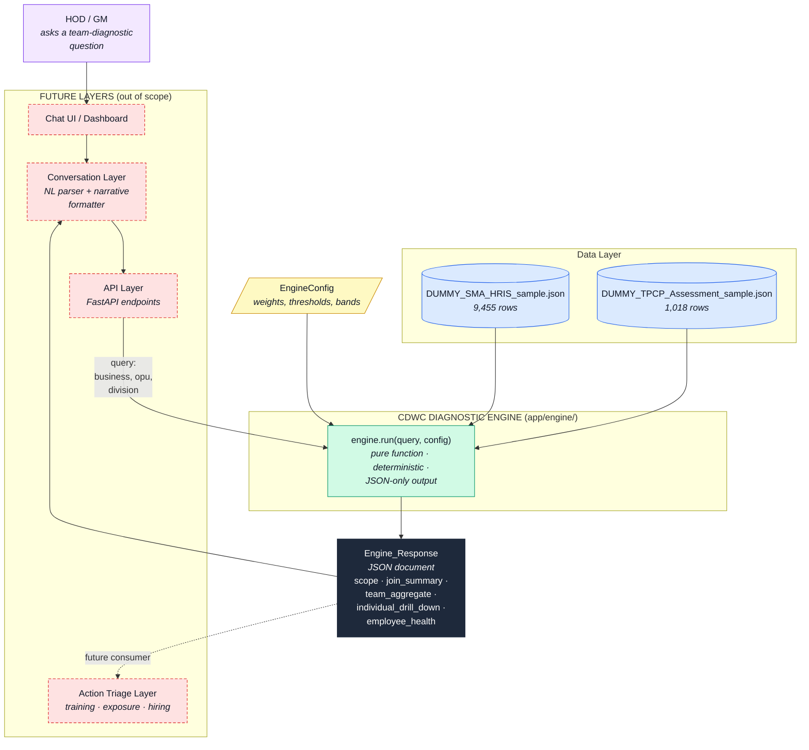
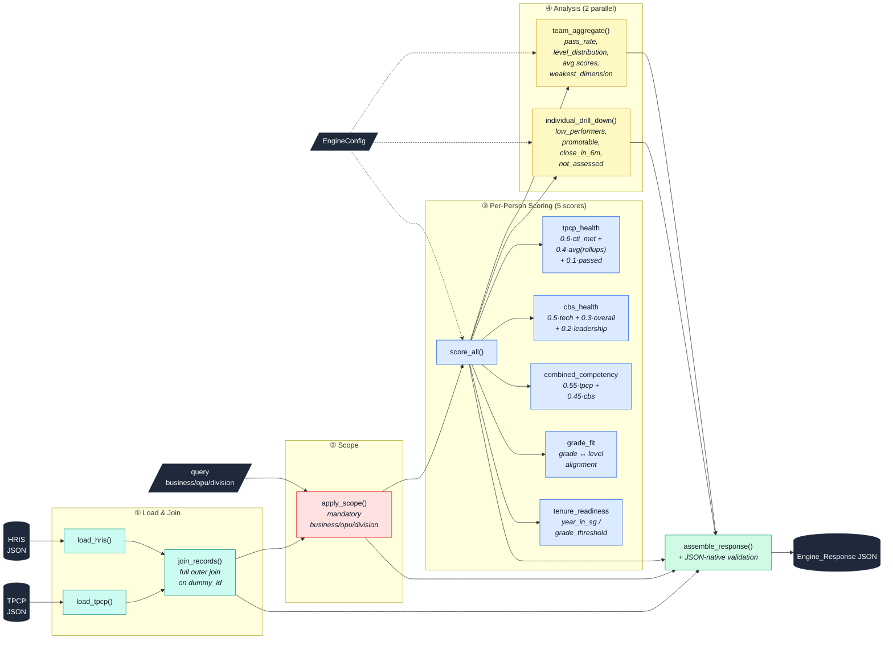

# CDWC Diagnostic Engine — High-Level Architecture

Two views: the engine in context (who calls it, what data it reads, what
it returns) and the engine internals (five-score pipeline with two
parallel analyses). Authoritative source: `.kiro/specs/recommendation-engine-redesign/design.md`.

## Context view

## Container view

## Scope boundary

| In scope (this engine) | Out of scope (other layers or deferred) |
|---|---|
| HRIS + TPCP ingestion | Free-text chat parsing, intent extraction |
| Full outer join on `dummy_id` | Any persistence layer (no DB, no cache) |
| Mandatory org-scope filtering | Authentication, authorisation, multi-tenant |
| 5 health scores per employee | `critical_gap_score` (dropped with per-cell fields) |
| Team aggregate rollup | Gap matrix / structural-vs-people classification |
| Individual drill-down (4 lists) | Action recommendations (training / exposure / hiring) |
| Structured JSON response | Natural-language narrative, dashboards, reports |
| Deterministic, config-driven formulas | Learned models, A/B testing, feature stores |
