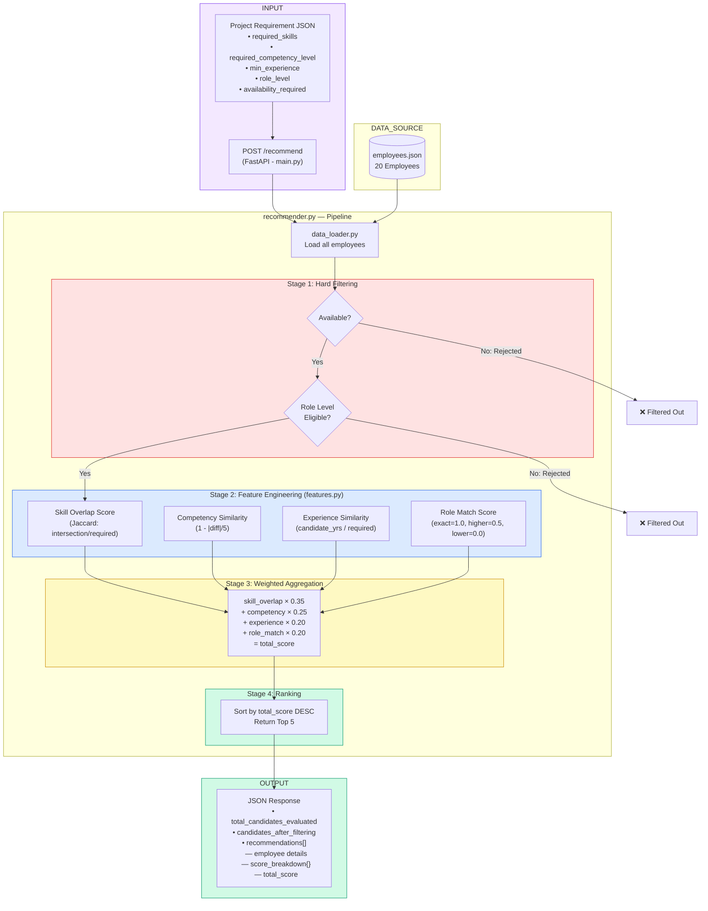

# CDWC Recommender Engine — Process Flow

Open this file in any Mermaid-compatible viewer (GitHub, VS Code with Mermaid extension, or paste into [mermaid.live](https://mermaid.live)).

```mermaid
flowchart TB
    subgraph INPUT
        A["POST /recommend<br/>(FastAPI - main.py)"]
        B["Project Requirement JSON<br/>• required_skills<br/>• required_competency_level<br/>• min_experience<br/>• role_level<br/>• availability_required"]
    end

    subgraph DATA_SOURCE
        C[("employees.json<br/>20 Employees")]
    end

    subgraph RECOMMENDER["recommender.py — Pipeline"]
        direction TB

        D["data_loader.py<br/>Load all employees"]

        subgraph STAGE1["Stage 1: Hard Filtering"]
            E{"Available?"}
            F{"Role Level<br/>Eligible?"}
        end

        subgraph STAGE2["Stage 2: Feature Engineering (features.py)"]
            G["Skill Overlap Score<br/>(Jaccard: intersection/required)"]
            H["Competency Similarity<br/>(1 - |diff|/5)"]
            I["Experience Similarity<br/>(candidate_yrs / required)"]
            J["Role Match Score<br/>(exact=1.0, higher=0.5, lower=0.0)"]
        end

        subgraph STAGE3["Stage 3: Weighted Aggregation"]
            K["skill_overlap × 0.35<br/>+ competency × 0.25<br/>+ experience × 0.20<br/>+ role_match × 0.20<br/>= total_score"]
        end

        subgraph STAGE4["Stage 4: Ranking"]
            L["Sort by total_score DESC<br/>Return Top 5"]
        end
    end

    subgraph OUTPUT
        M["JSON Response<br/>• total_candidates_evaluated<br/>• candidates_after_filtering<br/>• recommendations[]<br/>&nbsp;&nbsp;— employee details<br/>&nbsp;&nbsp;— score_breakdown{}<br/>&nbsp;&nbsp;— total_score"]
    end

    B --> A
    A --> D
    C --> D
    D --> E
    E -->|Yes| F
    E -->|No: Rejected| X1["❌ Filtered Out"]
    F -->|Yes| G
    F -->|No: Rejected| X2["❌ Filtered Out"]
    G --> K
    H --> K
    I --> K
    J --> K
    K --> L
    L --> M

    style STAGE1 fill:#fee2e2,stroke:#dc2626
    style STAGE2 fill:#dbeafe,stroke:#2563eb
    style STAGE3 fill:#fef9c3,stroke:#ca8a04
    style STAGE4 fill:#d1fae5,stroke:#059669
    style INPUT fill:#f3e8ff,stroke:#7c3aed
    style OUTPUT fill:#d1fae5,stroke:#059669
```
